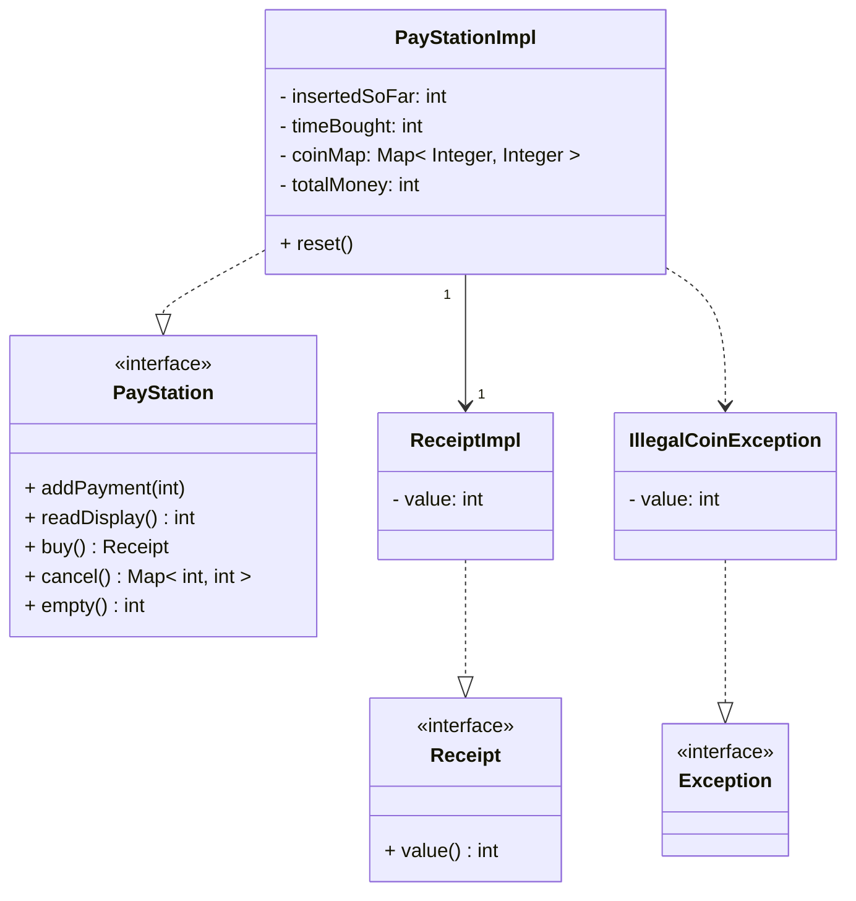

# PayStation Main Design Document

**CIS 3296 Section 0x**

**Fall 2024**

**Team Members**

<table>
<tr>
    <td align="center">
        <a href="https://github.com/ApplebaumIan">
            
             
            <b>Ian Tyler Applebaum</b>
        </a>
    </td>
    <td align="center">
        <a href="https://github.com/thanhnguyen46">
            
             
            <b>Thanh Nguyen</b>
        </a>
    </td>
</tr>
</table>

## Document Overview
This Design Document describes the software architecture and how the requirements are mapped into the design. This document will be a combination of diagrams and text that is describing what the diagrams are showing. The Design Document also specify the complete design of the software implementation using Javadoc.

## Architecture
This section describes the different components and their interfaces using UML. For example: client, server, database. For each component provide class diagrams showing the classes to be developed (or used) and their relationship.

## Detailed Design API
For each class define the data fields, methods.
-	The purpose of the class.
-	The purpose of each data field.
-	The purpose of each method
-	Pre-conditions if any.
-	Post-conditions if any.
-	Parameters and data types
-	Return value and output variables
-	Exceptions thrown*.
This information should be in structured comments (e.g. Javadoc) in the source files. A documentation generation tool (e.g. Javadoc) may be used to generate the document as a draft.


